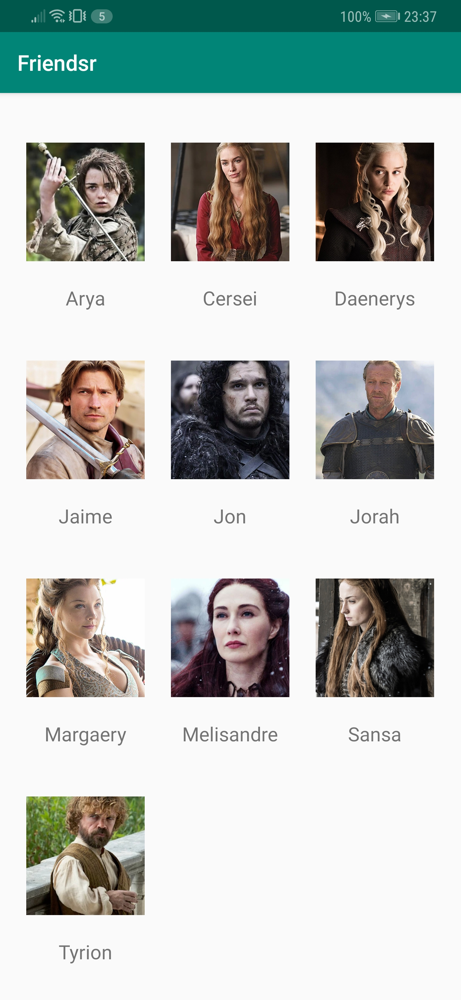
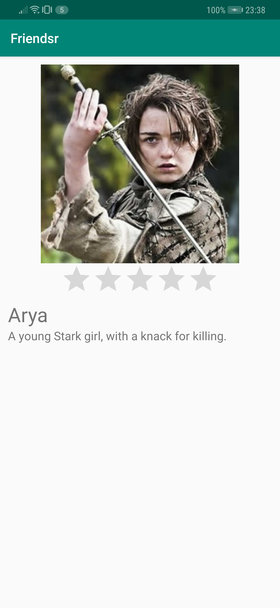
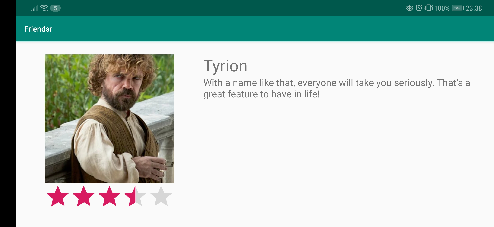

# Friendsr
A short description of the app Friendsr.

## Getting Started
### Prerequisites
The app is created in Android-Studio, it is currently made for API 24 Nougat (Android 7.0), but also confirmed running on API 28 Pie (Android 9.0).
An android phone with either one of those Android versions (and most likely the versions in between) will suffice.

## Test
When launching the app, a screen appears showing a list of your best friends! On this screen, only the profile picture and names of your friends are visible.

When clicking on one of the friends in the list, a new screen will appear: the profile screen. Here you can read the bio of your friend and see what rating your friend has.

You can change the rating for your friend by using the ratingbar to give them the amount of stars you want to rate them. This rating will be saved when you revisit the page. You can also use this app in landscape mode.

## Author
* Me

## Acknowledgements
* Renske Talsma
* Natasja Wezel
